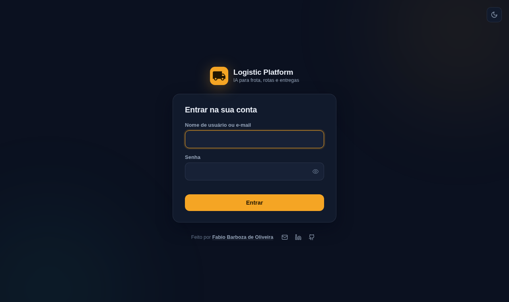
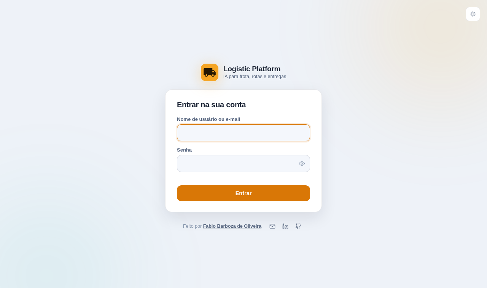
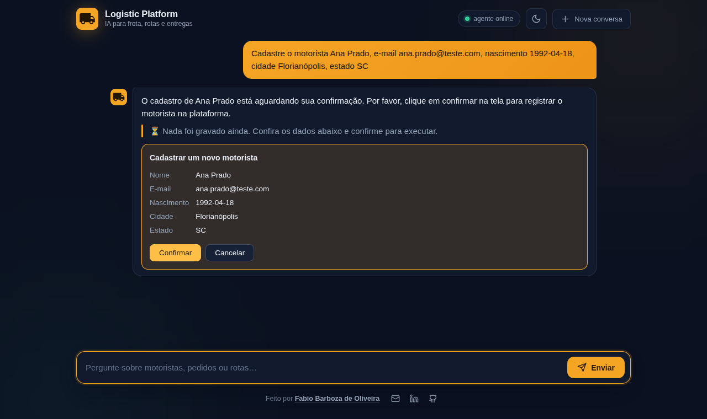
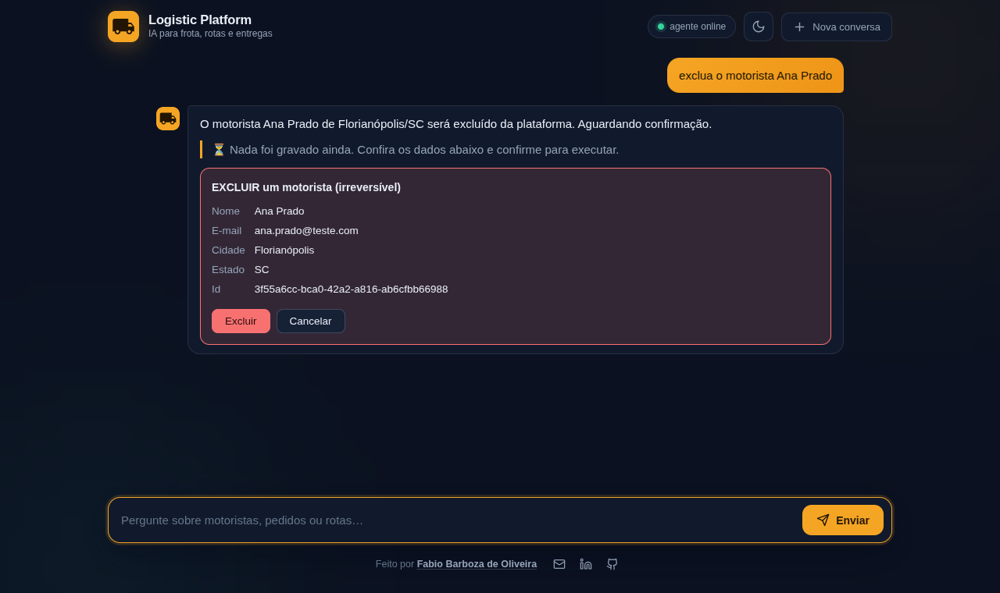
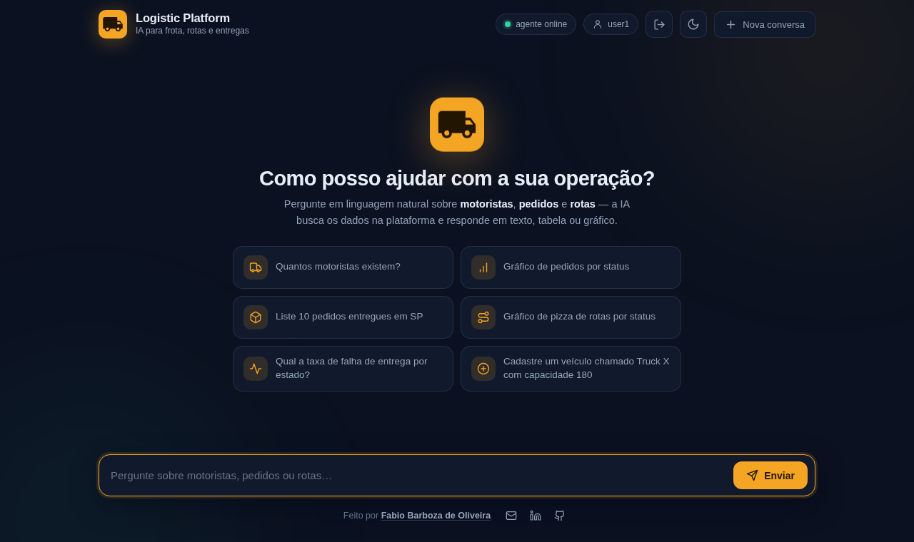

# Logistic Platform

**Agente de IA para logística** — um chat que responde perguntas sobre frota, rotas e entregas em
linguagem natural e devolve a resposta como texto, tabela ou gráfico. Funciona com qualquer LLM que
exponha API compatível com OpenAI — local ou na nuvem.

Três decisões sustentam todo o resto:

- **A LLM tem zero acesso ao banco.** Ela só chama tools MCP, e a fronteira é garantida por `GRANT`
  no Postgres, não por validação de string.
- **Toda chamada carrega uma identidade.** Login OAuth2/OIDC no Keycloak, e o token que chega ao
  servidor MCP não é o do browser: o agente troca por um com a audiência da API (RFC 8693), e cada
  tool confere a role antes de rodar ([o caminho do token](docs/security.md#autenticação-e-autorização)).
- **Toda resposta é rastreável ponta a ponta.** Prompt, tool escolhida, argumentos, retorno, tokens
  e latência viram traces OTLP no [Langfuse](docs/evals.md#observabilidade-langfuse).

Um agente que ninguém consegue auditar não vai para produção. Um que fala com o banco em nome de
ninguém, também não.

[](https://github.com/fabio-barboza/logistic-platform/actions/workflows/ci.yml)
[](https://openjdk.org/projects/jdk/21/)
[](https://spring.io/projects/spring-boot)
[](https://spring.io/projects/spring-ai)
[](https://modelcontextprotocol.io/)
[](https://www.keycloak.org/)
[](https://datatracker.ietf.org/doc/html/rfc8693)
[](https://www.postgresql.org/)
[](https://langfuse.com/)
[](https://www.linkedin.com/in/fabio-oliveira-20a977a1/)
[](https://github.com/fabio-barboza)

> **Obs.: isto é uma aplicação de demonstração.** As três aplicações exigem token válido do Keycloak
> — veja [Login e usuários](#login-e-usuários) para entrar assim que a stack subir. Rate limit ainda
> não está implementado. As fronteiras duras que existem hoje são a validação de token nas três
> aplicações e a checagem de role em cada tool MCP, a role read-only do Postgres, que impede o
> `executeQuery` de escrever, e o [human in the loop](docs/security.md#human-in-the-loop-aprovação-humana-na-escrita):
> toda escrita da LLM vira uma pendência que só executa depois do clique do usuário. Ainda assim, é
> ambiente de desenvolvimento — senha igual ao username, Postgres com credenciais padrão. Rode em
> `localhost`. Detalhes em [Aviso de segurança](docs/security.md#aviso-de-segurança).

## A demo em telas

A primeira tela não é o chat: é o login. O webui é uma SPA pública com PKCE, e quem desenha a tela é
o Keycloak — com o tema da aplicação, mesma paleta, mesma marca e o mesmo botão claro/escuro do chat.

<table>
<tr>
<td width="50%"></td>
<td width="50%"></td>
</tr>
</table>

<p align="center"><sub>Tema <code>logistic</code> no Keycloak: a tela de login é parte da aplicação,
não uma página de terceiro no meio do caminho.</sub></p>


<p align="center"><sub>Pergunta em português; o modelo escolhe as tools, busca os dados via MCP e
decide se a resposta vira gráfico, tabela ou texto. No topo, o usuário autenticado e o botão de
sair.</sub></p>





<p align="center"><sub>Escrita não sai da LLM direto para o banco: ela vira uma pendência com os
dados na tela, e só o clique do usuário executa. Exclusão mostra o registro que será apagado — e o
card em vermelho é a diferença entre "cadastrar" e "não tem desfazer".</sub></p>

## O que este projeto demonstra

Um caso de uso completo de **IA aplicada a um domínio de negócio real**, construído com o stack
Java moderno:

- **Spring AI + Model Context Protocol (MCP)** — o agente descobre as ferramentas em runtime,
  via handshake MCP com a API de domínio. Nenhuma tool está hardcoded no agente.
- **Tool calling com fronteira de segurança** — a LLM decide *o quê* perguntar; a API decide
  *como* buscar. O modelo nunca escreve no banco e a única query livre que ele pode emitir roda
  numa role Postgres read-only, garantida por `GRANT`, não por validação de string.
- **OAuth2/OIDC ponta a ponta** — SPA pública com PKCE, agente que é resource server *e* client
  confidencial, *token exchange* (RFC 8693) antes de falar MCP e checagem de role dentro de cada
  tool. O token do usuário **não** atravessa para o servidor MCP — é o que a spec do MCP proíbe, e é
  o vetor clássico de *confused deputy* ([como funciona](docs/security.md#autenticação-e-autorização)).
- **Respostas multimodais** — o modelo escolhe entre texto, tabela ou gráfico chamando tools
  locais de render; o front-end só despacha o payload tipado que recebe.
- **Human in the loop na escrita** — nenhuma tool de escrita executa na chamada do modelo: ela
  vira uma pendência que o usuário confirma ou cancela na tela, e o que roda depois é o payload
  original, sem passar pela LLM de novo. É o guardrail que falta na maioria das demos de agente
  ([como funciona](docs/security.md#human-in-the-loop-aprovação-humana-na-escrita)).
- **Memória conversacional isolada por usuário** — janela de 20 mensagens por sessão, então "e em
  MG?" continua a pergunta anterior; e a chave da conversa combina o `sub` do token com o
  `sessionId`, para o id de sessão de um usuário não abrir a conversa de outro.
- **Modelo agnóstico** — a integração é com o contrato OpenAI, não com um fornecedor. Troque para
  Claude, GPT, Gemini ou o que preferir mudando `base-url`, `api-key` e `chat.options.model` no
  `application.yml` do agent.
  Esta demo vem apontada para um modelo local (`qwen3.6:35b`) só para rodar offline e sem custo.
- **Observabilidade de LLM** — traces OTLP para o [Langfuse](https://langfuse.com): prompt,
  resposta, tokens, qual tool MCP o modelo escolheu, com que argumentos e o que ela devolveu —
  tudo agrupado por sessão de conversa. Opcional e desligado por padrão
  ([como ligar](docs/evals.md#observabilidade-langfuse)).
- **Eval do agente** — 50 perguntas com a tool, os argumentos, o render e o texto esperados,
  medindo a decisão do modelo. É o que pega a regressão que teste de Java nenhum pega: a que mora
  no prompt. Roda só sob demanda (`-Peval`), porque depende de uma LLM de verdade — e o dataset é
  duro o bastante para ainda apontar falha ([saída](docs/evals.md#testes-e-eval)).
- **Um comando sobe tudo** — `./start.sh` orquestra Postgres, Keycloak, Flyway, seed, duas apps
  Spring Boot e o front, respeitando as dependências de ordem entre elas
  ([o que ele faz](#subindo-a-stack)).

## Arquitetura

```
                                   ┌──────────────────────────────┐
                                   │  Keycloak :8090              │
             Authorization Code    │  realm logistic              │
             + PKCE          ┌────►│  roles: chat, read, write    │
                             │     └──────────────────────────────┘
                             │                    ▲
Browser — logistic-webui :5173                    │  token exchange (RFC 8693)
    │                                             │  aud: logistic-agent → logistic-api
    │  POST /api/chat                             │
    │  Authorization: Bearer <aud=logistic-agent> │
    ▼                                             │
logistic-agent (Spring Boot :8080) ───────────────┘
    │  resource server (valida o token do browser) + client OAuth2 (troca o token)
    │  ChatClient (Spring AI)
    │    ├── LLM OpenAI-compat  →  http://localhost:8200  (qwen3.6:35b)
    │    ├── tools locais: renderChart / renderTable
    │    └── tools MCP (descobertas do logistic-api no startup)
    │            │  MCP Streamable HTTP + Bearer <aud=logistic-api>
    │            ▼
logistic-api (Spring Boot :8081)
    │  @McpTool → McpAuthorization.require(ctx, "read" | "write")
    │       └──► Service ◄── @RestController (REST + Swagger)
    │                │
    │            Repository (JPA)   +   QueryService (conexão na role logistic_ro)
    ▼
PostgreSQL 18 :5432             ← docker compose (raiz) + Flyway
```

### Decisões de arquitetura

| Decisão | Por quê |
|---------|---------|
| **A LLM nunca toca o banco** | O modelo só enxerga *tools*, não tabelas. Quem executa SQL é sempre a `logistic-api`. O `logistic-agent` sequer tem datasource no `pom.xml` — precisou de dado novo? Nasce uma tool MCP, não um repositório no agente. |
| **MCP em vez de tools hardcoded** | As ferramentas vivem junto do domínio que elas servem. O agente as descobre no startup; adicionar um caso de uso na API o disponibiliza para a LLM sem recompilar o agente. |
| **Controller REST e tools MCP como adaptadores irmãos** | Ambos são camadas finas sobre o mesmo `service/`. A regra de negócio existe uma vez só e vale igual para humano (Swagger) e para modelo (MCP). |
| **`executeQuery` blindado por `GRANT`, não por regex** | Para as perguntas que nenhuma tool específica cobre, a LLM escreve o `SELECT`. A garantia de que ela não escreve no banco é uma role Postgres read-only (`logistic_ro`) com `statement_timeout` — defesa no lugar certo, não em validação de string. |
| **O token do usuário não atravessa para o MCP** | O agente troca o token (`aud=logistic-agent`) por um `aud=logistic-api` antes de chamar o `/mcp`. A spec de autorização do MCP é normativa nisso — repassar o token recebido é *token passthrough*, o vetor do confused deputy. |
| **Autorização dentro da tool, não em `@PreAuthorize`** | O SDK MCP roda a tool numa thread do `boundedElastic`; o `SecurityContextHolder` é `ThreadLocal` e está vazio lá — `@PreAuthorize` negaria até para o `admin`. A role é conferida com o `McpTransportContext`, que viaja pelo Reactor Context e não depende de thread. |
| **Schema descrito por tool, não por system prompt** | `describeSchema` entrega o modelo de dados sob demanda, mantendo o system prompt enxuto e a janela de contexto livre para a conversa. |
| **Render por *side-channel*** | As tools de render não devolvem dados ao modelo: gravam num holder *request-scoped* que o serviço lê depois. O modelo não gasta contexto reproduzindo o dataset que o gráfico já contém. |
| **Escrita só com aprovação humana** | O decorator de tools classifica **por exclusão** — leitura é `executeQuery` e `describeSchema`, todo o resto é escrita e nasce exigindo confirmação. Tool nova entra protegida por padrão; o esquecimento leva ao lado seguro. |
| **Descrição de tool é prompt, não documentação** | Cada `@McpTool` descreve valores de enum e traz exemplo — é isso que faz o modelo escolher a ferramenta certa na primeira tentativa. |

## Os 3 projetos (+ Keycloak)

| Diretório | Stack | Porta | Responsabilidade |
|-----------|-------|-------|------------------|
| [`logistic-webui/`](logistic-webui/README.md) | Vite 8, Chart.js 4, marked (JS puro) | 5173 | Chat no browser; login com PKCE, renderiza markdown, tabela e gráfico |
| [`logistic-agent/`](logistic-agent/README.md) | Java 21, Spring Boot 4, Spring AI (MCP client) | 8080 | Conversa com a LLM, descobre as tools MCP, troca o token, monta o `renderData` |
| [`logistic-api/`](logistic-api/README.md) | Java 21, Spring Boot 4, JPA, Flyway, MCP server | 8081 | Dono do domínio e do banco; expõe REST + tools MCP com autorização por role |
| Keycloak (`quay.io/keycloak/keycloak:26.7`) | Realm `logistic`, importado no primeiro boot | 8090 | Emite e valida os tokens das três apps; tela de login com o tema da aplicação |

## Subindo a stack

### Pré-requisitos

- **Java 21** (ou superior)
- **Node 20+** com npm
- **Docker** com o plugin Compose v2, daemon rodando
- **Uma LLM com API compatível com OpenAI**, acessível pelo agent

O `application.yml` do `logistic-agent` já vem apontado para um modelo local (`qwen3.6:35b` em
`http://localhost:8200`), que é como esta demo foi construída — sem custo e sem dado saindo da
máquina. Está em outra máquina da rede? `LLM_BASE_URL` e `LLM_MODEL` no `.env` da raiz sobrescrevem
sem rebuild. Para usar um provedor na nuvem, ajuste `base-url`, `api-key` e `chat.options.model`.

A LLM é o único pré-requisito opcional na subida: o script avisa e sobe a stack mesmo assim,
mas o chat só responde quando o modelo estiver no ar.

### Um comando

```bash
./start.sh          # Linux / macOS
```

```bat
.\start.bat         REM Windows (wrapper do start.ps1)
```

`Ctrl+C` derruba tudo: `TERM` nas três apps (`KILL` se não morrerem em 10s) e `docker compose stop`
nos containers — para o container, preserva o volume do banco.

### O que ele faz, em ordem — e por que a ordem importa

1. **Checa pré-requisitos e portas.** Java, Node, Docker, e as portas 5432, 8090, 8081, 8080, 5173.
   Container da stack já de pé é reaproveitado, não é motivo de erro.
2. **Sobe o Postgres e o Keycloak** (`docker compose up -d`) e espera os dois ficarem prontos — o
   Keycloak pelo `/health/ready` na porta de management (9000). No **primeiro** boot ele importa o
   realm `logistic` do `infra/keycloak/import`: clients, roles, usuários e o tema.
3. **Sobe a `logistic-api`** e espera o `/actuator/health`. O Flyway aplica as migrations na subida,
   e o `JwtDecoder` resolve o issuer no Keycloak ainda no boot — **por isso o Keycloak vem antes**:
   sem ele, a API não sobe.
4. **Semeia o banco**, se estiver vazio (conta os motoristas; `0` significa banco novo).
5. **Sobe o `logistic-agent`** e espera o `/api/chat/health`. O agente faz o handshake MCP no
   startup — **por isso a API vem antes**: se ela não estiver respondendo, ele sobe sem tool nenhuma
   e o chat responde "erro ao processar" para qualquer pergunta.
6. **Sobe o webui** (Vite) e imprime as URLs.

A espera entre as etapas não é enfeite: cada uma delas é uma dependência real, e pular qualquer uma
produz uma falha que só aparece na primeira pergunta do usuário.

| URL | O que é |
|-----|---------|
| <http://localhost:5173> | webui — a demo |
| <http://localhost:8080> | logistic-agent |
| <http://localhost:8081> | logistic-api |
| <http://localhost:8081/swagger-ui.html> | Swagger da API |
| <http://localhost:8090> | Keycloak (console admin: `admin`/`admin`) |

### Login e usuários

Abrir <http://localhost:5173> redireciona para o Keycloak — não dá para usar o chat sem entrar.
Três usuários já vêm no realm importado, senha igual ao username:

| Usuário | Senha | Roles | Consegue |
|---------|-------|-------|----------|
| `user1` | `user1` | `chat`, `read`, `write` | Conversar, consultar dados e **confirmar** escritas (cadastrar, excluir) |
| `user2` | `user2` | `chat`, `read` | Conversar e consultar dados. As tools de escrita não são nem oferecidas ao modelo, e a API recusaria com 403 se a chamada viesse por fora — nenhuma escrita dele chega ao banco |
| `admin` | `admin` | `admin` (composta: `chat`+`read`+`write`) | Tudo que `user1` consegue, mais o console administrativo do Keycloak |

`admin` ser uma role **composta** é o motivo de nenhuma regra em Java citar `"admin"`: o Keycloak já
expande a composta em `realm_access.roles`, e quem a tem passa em qualquer `hasRole` sem código
extra.



A sessão fica ociosa por até 5 minutos antes de expirar (só quando não há atividade — uma resposta
longa da LLM não desloga ninguém no meio); depois disso o próximo clique manda de volta para o login.
`Sair` (no cabeçalho do chat) encerra a sessão no Keycloak também, não só no browser.

Quer testar as duas contas? Duas abas anônimas do navegador (uma pra cada usuário) — sessões
normais do mesmo browser compartilham o Keycloak logado.

> **Mudou o realm JSON depois de o Keycloak já ter subido?** `--import-realm` só lê o volume no
> primeiro boot. É `docker compose down -v` e subir de novo, ou editar pela UI/Admin API. É a
> pegadinha número um dessa configuração. O **tema** não tem esse problema: em `start-dev` não há
> cache de tema, então editar `.ftl`/`.css` e dar F5 basta.

### Opções dos scripts

| Bash | PowerShell | Efeito |
|------|-----------|--------|
| *(nenhuma)* | *(nenhuma)* | sobe tudo **sem compilar**, semeia **se o banco estiver vazio** |
| `--build` | `-Build` | recompila api e agent, e roda `npm install` no webui |
| `--no-build` | `-NoBuild` | nunca compila: falha se faltar jar ou `node_modules` |
| `--reset` | `-Reset` | limpa o banco e reinsere o `dados.sql`, mesmo populado. Pede confirmação (`s/N`) |
| `--no-seed` | `-NoSeed` | nunca semeia, nem com banco vazio |
| `--yes` | `-Yes` | pula a confirmação do `--reset` |
| `--help` | `-Help` | imprime a tabela de flags |

Comportamentos que não são óbvios:

- **O padrão não compila.** Mudou código Java ou JS? Rode com `--build`, senão a stack sobe com
  o artefato antigo. A única exceção é a primeira execução: sem jar ou sem `node_modules` não há
  o que subir, então o script compila sozinho. `--no-build` tira até essa exceção e falha.
- **O seed roda sozinho só na primeira vez.** O script conta os motoristas; `0` significa banco
  vazio e ele aplica o `dados.sql`. Da segunda execução em diante, imprime
  `Banco já populado (N motoristas) — seed ignorado.` O `TRUNCATE` no topo do `dados.sql` é
  inofensivo nesse caminho: só executa quando não há o que apagar.
- **`--reset` gera um dataset diferente a cada execução.** O seed usa `random()` na distribuição
  de rotas e pedidos, então os gráficos mudam. É reset de **dados**, não de estrutura: o schema
  e o histórico do Flyway ficam intactos.

### Subida manual

Para debugar no IDE, sem os scripts — a ordem é a mesma, pelos mesmos motivos:

```bash
# 1. banco + Keycloak (o realm "logistic" é importado no primeiro boot do container)
docker compose up -d

# 2. api (Flyway cria o schema na subida; o JwtDecoder já busca o issuer no Keycloak aqui)
cd logistic-api && ./mvnw spring-boot:run

# 3. seed, se o banco estiver vazio
docker exec -i logisticdb psql -U postgres -d logisticdb \
  < logistic-api/src/main/resources/db/seed/dados.sql

# 4. agent (precisa da api já no ar: é no startup que ele descobre as tools MCP)
cd logistic-agent && ./mvnw spring-boot:run

# 5. webui
cd logistic-webui && npm install && npm run dev
```

## Em detalhe

Duas partes do projeto têm documento próprio, porque cada uma é uma discussão inteira:

| Documento | O que tem lá |
|-----------|--------------|
| [**Segurança**](docs/security.md) | OAuth2/OIDC ponta a ponta, o caminho do token com *token exchange* (RFC 8693), autorização por role dentro de cada tool MCP, human in the loop na escrita, e o aviso de segurança completo |
| [**Eval e observabilidade**](docs/evals.md) | O dataset de 50 casos e as oito dimensões de avaliação, a saída de uma execução real com as falhas que sobraram, e o tracing OTLP no Langfuse |

## Logs

Cada app escreve num arquivo próprio; o terminal do script mostra só o progresso e as URLs.

```bash
tail -f logs/logistic-agent.log
tail -f logs/logistic-api.log
tail -f logs/logistic-webui.log
```

## Perguntas de exemplo

Roteiro de demo e teste de fumaça, com o navegador em <http://localhost:5173> (logado como `user1`):

| Pergunta | Esperado |
|----------|----------|
| quantos motoristas existem? | texto com o número |
| liste os pedidos entregues em SP | tabela renderizada |
| gráfico de pedidos por status | gráfico bar ou pie, status em PT-BR |
| e em MG? | mantém o contexto da pergunta anterior |
| cadastre um veículo chamado Truck X com capacidade 180 | card de confirmação; grava só depois do clique em **Confirmar** |
| cadastre um motorista chamado João | pergunta os campos que faltam em vez de inventar e-mail e nascimento |
| exclua o veículo Truck X | card **vermelho** com o veículo encontrado; some da frota depois do clique em **Excluir** |
| apague o pedido mais antigo | recusa: pedido não tem exclusão, e a resposta diz isso sem inventar motivo |
| qual a taxa de falha de entrega por estado? | agrega via tool MCP e responde |

Repita as duas últimas escritas logado como `user2` (sem `write`): nenhuma delas vira card, porque as
tools de escrita nem chegam ao modelo.

## Troubleshooting

| Sintoma | Causa provável | Saída |
|---------|----------------|-------|
| `porta 5432 já está ocupada` | container `logisticdb` de outra sessão, ou Postgres nativo | `docker rm -f logisticdb`, ou pare o serviço local |
| `porta 8080/8081/5173 já está ocupada` | app da execução anterior ficou de pé | `jps` / `lsof -i :8080` e mate o processo |
| `AVISO: LLM não respondeu` | modelo fora do ar | suba o `qwen3.6:35b` em `http://localhost:8200`; a stack não precisa reiniciar |
| chat responde "erro ao processar" | agent subiu sem as tools MCP | confira `logs/logistic-agent.log`; a API tem que estar respondendo `/actuator/health` **antes** do agent |
| `logistic-api não subiu em 90s` | Flyway falhou, banco inacessível — ou o Keycloak não estava no ar (o `JwtDecoder` resolve o issuer no boot) | `tail -n 50 logs/logistic-api.log` |
| login redireciona e volta com `invalid redirect_uri` | webui rodando em porta/host diferente do registrado no realm | o client `logistic-webui` aceita `http://localhost:5173/*`; use exatamente essa URL |
| `401` no `POST /api/chat` | token expirado ou de outra audiência | recarregue a página (o webui refaz o fluxo); confira que o realm é o `logistic` |
| a tela de login voltou a ser a do Keycloak, sem a marca | `loginTheme` não aplicado — realm importado antes do tema existir | `docker compose down -v` e suba de novo, ou ajuste **Realm settings → Themes** na UI |
| mudou o realm JSON e nada mudou | `--import-realm` só lê o volume no primeiro boot | `docker compose down -v` e suba de novo |
| gráfico não aparece | o modelo respondeu só texto | reformule pedindo "gráfico de ..." explicitamente |

## Autor

**Fabio Barboza de Oliveira**

[](https://www.linkedin.com/in/fabio-oliveira-20a977a1/)
[](https://github.com/fabio-barboza)

Se este projeto te foi útil ou você quer trocar ideia sobre Spring AI, MCP e agentes de IA
aplicados a domínios de negócio, me chama no LinkedIn. ⭐ no repositório também ajuda.
