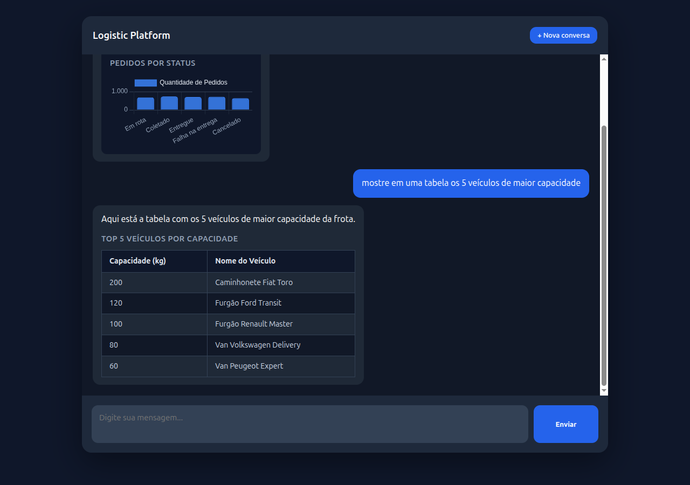

# Logistic Platform

**Agente de IA para logística** — um chat que responde perguntas sobre frota, rotas e entregas em
linguagem natural e devolve a resposta como texto, tabela ou gráfico. Funciona com qualquer LLM que
exponha API compatível com OpenAI — local ou na nuvem — e o modelo tem **zero acesso ao banco de dados**.

[](https://openjdk.org/projects/jdk/21/)
[](https://spring.io/projects/spring-boot)
[](https://spring.io/projects/spring-ai)
[](https://modelcontextprotocol.io/)
[](https://www.postgresql.org/)
[](https://vite.dev/)
[](https://www.linkedin.com/in/fabio-oliveira-20a977a1/)
[](https://github.com/fabio-barboza)



<p align="center"><sub>Duas perguntas em português; o modelo escolhe as tools, busca os dados via MCP
e decide renderizar gráfico ou tabela.</sub></p>

## O que este projeto demonstra

Um caso de uso completo de **IA aplicada a um domínio de negócio real**, construído com o stack
Java moderno:

- **Spring AI + Model Context Protocol (MCP)** — o agente descobre as ferramentas em runtime,
  via handshake MCP com a API de domínio. Nenhuma tool está hardcoded no agente.
- **Tool calling com fronteira de segurança** — a LLM decide *o quê* perguntar; a API decide
  *como* buscar. O modelo nunca escreve no banco e a única query livre que ele pode emitir roda
  numa role Postgres read-only, garantida por `GRANT`, não por validação de string.
- **Respostas multimodais** — o modelo escolhe entre texto, tabela ou gráfico chamando tools
  locais de render; o front-end só despacha o payload tipado que recebe.
- **Memória conversacional** — janela de 20 mensagens por sessão, então "e em MG?" continua a
  pergunta anterior.
- **Modelo agnóstico** — a integração é com o contrato OpenAI, não com um fornecedor. Troque para
  Claude, GPT, Gemini ou o que preferir mudando `base-url`, `api-key` e `chat.options.model` no
  `application.yml` do agent.
  Esta demo vem apontada para um modelo local (`qwen3.6:35b`) só para rodar offline e sem custo.
Seguinte:   - **Eval do agente** — dataset de perguntas com a tool esperada, medindo a escolha do modelo. É o
  que pega a regressão que teste de Java nenhum pega: a que mora no prompt. Roda só sob demanda
  (`-Peval`), porque depende de uma LLM de verdade.
- **Um comando sobe tudo** — `./start.sh` orquestra Postgres, Flyway, seed, duas apps Spring Boot
  e o front, respeitando as dependências de ordem entre elas.

## Arquitetura

```
Browser (logistic-webui :5173)
    │  POST /api/chat  { message, sessionId }
    ▼
logistic-agent (Spring Boot :8080)
    │  ChatClient (Spring AI)
    │    ├── LLM local OpenAI-compat  →  http://localhost:8200  (qwen3.6:35b)
    │    ├── tools locais: renderChart / renderTable
    │    └── tools MCP (descobertas do logistic-api)
    │            │  MCP Streamable HTTP
    │            ▼
logistic-api (Spring Boot :8081)
    │  @McpTool  →  Service  ←  @RestController
    │                  │
    │              Repository (Spring Data JPA)
    ▼
PostgreSQL 18 (pgvector) :5432   ← docker compose + Flyway
```

### Decisões de arquitetura

| Decisão | Por quê |
|---------|---------|
| **A LLM nunca toca o banco** | O modelo só enxerga *tools*, não tabelas. Quem executa SQL é sempre a `logistic-api`. O `logistic-agent` sequer tem datasource no `pom.xml` — precisou de dado novo? Nasce uma tool MCP, não um repositório no agente. |
| **MCP em vez de tools hardcoded** | As ferramentas vivem junto do domínio que elas servem. O agente as descobre no startup; adicionar um caso de uso na API o disponibiliza para a LLM sem recompilar o agente. |
| **Controller REST e tools MCP como adaptadores irmãos** | Ambos são camadas finas sobre o mesmo `service/`. A regra de negócio existe uma vez só e vale igual para humano (Swagger) e para modelo (MCP). |
| **`executeQuery` blindado por `GRANT`, não por regex** | Para as perguntas que nenhuma tool específica cobre, a LLM escreve o `SELECT`. A garantia de que ela não escreve no banco é uma role Postgres read-only (`logistic_ro`) com `statement_timeout` — defesa no lugar certo, não em validação de string. |
| **Schema descrito por tool, não por system prompt** | `describeSchema` entrega o modelo de dados sob demanda, mantendo o system prompt enxuto e a janela de contexto livre para a conversa. |
| **Render por *side-channel*** | As tools de render não devolvem dados ao modelo: gravam num holder *request-scoped* que o serviço lê depois. O modelo não gasta contexto reproduzindo o dataset que o gráfico já contém. |
| **Descrição de tool é prompt, não documentação** | Cada `@McpTool` descreve valores de enum e traz exemplo — é isso que faz o modelo escolher a ferramenta certa na primeira tentativa. |

## Os 3 projetos

| Diretório | Stack | Porta | Responsabilidade |
|-----------|-------|-------|------------------|
| [`logistic-webui/`](logistic-webui/README.md) | Vite 8, Chart.js 4, marked (JS puro) | 5173 | Chat no browser; renderiza markdown, tabela e gráfico |
| [`logistic-agent/`](logistic-agent/README.md) | Java 21, Spring Boot 4, Spring AI (MCP client) | 8080 | Conversa com a LLM, descobre as tools MCP, monta o `renderData` |
| [`logistic-api/`](logistic-api/README.md) | Java 21, Spring Boot 4, JPA, Flyway, MCP server | 8081 | Dono do domínio e do banco; expõe REST + tools MCP |

## Pré-requisitos

- **Java 21** (ou superior)
- **Node 20+** com npm
- **Docker** com o plugin Compose v2, daemon rodando
- **Uma LLM com API compatível com OpenAI**, acessível pelo agent

O `application.yml` do `logistic-agent` já vem apontado para um modelo local (`qwen3.6:35b` em
`http://localhost:8200`), que é como esta demo foi construída — sem custo e sem dado saindo da
máquina. Para usar um provedor na nuvem, ajuste `base-url`, `api-key` e `chat.options.model`.

A LLM é o único pré-requisito opcional na subida: o script avisa e sobe a stack mesmo assim,
mas o chat só responde quando o modelo estiver no ar.

## Rodando

```bash
./start.sh          # Linux / macOS
```

```bat
.\start.bat         REM Windows (wrapper do start.ps1)
```

Um comando sobe tudo; `Ctrl+C` derruba tudo. Ao final o script imprime:

| URL | O que é |
|-----|---------|
| <http://localhost:5173> | webui — a demo |
| <http://localhost:8080> | logistic-agent |
| <http://localhost:8081> | logistic-api |
| <http://localhost:8081/swagger-ui.html> | Swagger da API |

O que o script faz, em ordem: checa pré-requisitos e portas, confere que os artefatos existem, sobe o
Postgres e espera o `pg_isready`, sobe a API e espera o `/actuator/health`, semeia o banco se
estiver vazio, sobe o agent e espera o `/api/chat/health`, sobe o webui. A espera entre
etapas não é opcional — sem ela o agent sobe antes das tools MCP existirem e falha o handshake.

## Opções dos scripts

| Bash | PowerShell | Efeito |
|------|-----------|--------|
| *(nenhuma)* | *(nenhuma)* | sobe tudo **sem compilar**, semeia **se o banco estiver vazio** |
| `--build` | `-Build` | recompila api e agent, e roda `npm install` no webui |
| `--no-build` | `-NoBuild` | nunca compila: falha se faltar jar ou `node_modules` |
| `--reset` | `-Reset` | limpa o banco e reinsere o `dados.sql`, mesmo populado. Pede confirmação (`s/N`) |
| `--no-seed` | `-NoSeed` | nunca semeia, nem com banco vazio |
| `--yes` | `-Yes` | pula a confirmação do `--reset` |
| `--help` | `-Help` | imprime a tabela de flags |

Comportamentos que não são óbvios:

- **O padrão não compila.** Mudou código Java ou JS? Rode com `--build`, senão a stack sobe com
  o artefato antigo. A única exceção é a primeira execução: sem jar ou sem `node_modules` não há
  o que subir, então o script compila sozinho. `--no-build` tira até essa exceção e falha.
- **O seed roda sozinho só na primeira vez.** O script conta os motoristas; `0` significa banco
  vazio e ele aplica o `dados.sql`. Da segunda execução em diante, imprime
  `Banco já populado (N motoristas) — seed ignorado.` O `TRUNCATE` no topo do `dados.sql` é
  inofensivo nesse caminho: só executa quando não há o que apagar.
- **`--reset` gera um dataset diferente a cada execução.** O seed usa `random()` na distribuição
  de rotas e pedidos, então os gráficos mudam. É reset de **dados**, não de estrutura: o schema
  e o histórico do Flyway ficam intactos.
- **`Ctrl+C` não perde dados.** O shutdown manda `TERM` nas 3 apps (`KILL` se não morrerem em 10s)
  e roda `docker compose stop` — para o container, preserva o volume.

## Testes e eval

Build padrão — offline, sem Docker e sem modelo:

```bash
cd logistic-api   && ./mvnw test
cd logistic-agent && ./mvnw test
```

### Por que um eval, e não só testes

Num sistema com LLM, a maior parte do comportamento não está no código Java — está no **system
prompt** e nas **descrições das tools**. Nenhum teste tradicional cobre isso: dá para ter 100% de
cobertura no `service/`, no `controller/` e nas tools MCP, e ainda assim o produto quebrar porque
alguém reescreveu uma frase do prompt e o modelo passou a chamar `executeQuery` (SQL livre) onde
existia uma tool tipada. Compila, passa em tudo, e responde pior.

O eval fecha exatamente esse buraco: ele testa a **decisão do modelo**, não a fiação. É a suíte que
fica vermelha quando a regressão é de prompt.

### O que ele cobre

Um dataset de perguntas em português, cada uma com a tool esperada e o render esperado. Os casos
foram escolhidos para cobrir as promessas que o system prompt faz — cada linha abaixo é uma regra de
negócio do agente que, sem eval, ninguém verificava:

| Caso | O que verifica |
|------|----------------|
| `count-orders-by-status`, `count-routes-by-status` | contagem via `countOrdersBy`/`countRoutesBy`, **sem** listar registros e contar na mão — o erro clássico do modelo em listas grandes |
| `typed-search-orders`, `typed-search-routes`, `table-vehicles` | preferência pelas tools tipadas; `executeQuery` é explicitamente proibido nesses casos |
| `sql-for-join` | o inverso: pergunta com join e agregação **deve** cair no `executeQuery` |
| `count-drivers` | contagem fora do catálogo das tools de agregação, que o prompt manda resolver com `SELECT COUNT(*)` |
| `schema-question` | pergunta sobre o modelo de dados chama `describeSchema` em vez de chutar campos |
| `chart-orders-by-status`, `table-vehicles` | escolha do render: gráfico quando pedem gráfico, tabela quando pedem tabela |
| `memory-followup` | "e em MG?" depois de uma pergunta sobre SP — a memória conversacional preserva a intenção |

Cada caso avalia três coisas: qual tool foi chamada, qual tool **não** podia ser chamada, e se o
render final foi `chart`, `table` ou nenhum.

### Como rodar

```bash
cd logistic-agent && ./mvnw test -Peval
```

Decisões de desenho que valem citar:

- **Só roda quando pedido.** O `surefire` exclui a tag `eval` no build padrão; `-Peval` inverte e
  roda *apenas* esses testes. Eval depende de infraestrutura externa e de uma LLM — não pode ser
  gate de commit.
- **Quem roda garante o ambiente.** Um `ExecutionCondition` confere a API e a LLM **antes** de o
  Spring subir o contexto: falta alguma coisa, aborta em milissegundos com uma frase acionável, em
  vez de um `Failed to load ApplicationContext` de trinta linhas. Falha, nunca pula: um skip verde
  esconderia que nada foi medido.
- **O assert é sobre a taxa de acerto**, não caso a caso. Com LLM, um caso isolado falha por ruído e
  o assert exato deixaria o build vermelho de forma aleatória. Piso ajustável com
  `-Deval.threshold=0.9`.
- **`temperature=0` só no eval.** Produção roda em 0.7; medição precisa ser reproduzível.
- **Sem gambiarra no código de produção.** As chamadas são capturadas por um `ToolCallbackProvider`
  decorador registrado apenas no contexto de teste — o `ChatClientConfig` continua recebendo um
  provider qualquer e não sabe que está sendo observado. O render é verificado pelo `RenderHolder`,
  com uma requisição nova por caso.

Saída (`qwen3.6:35b`, dataset de 10 casos — trecho):

```
=== Eval: seleção de tools ===
tools MCP descobertas: 21 | modelo: qwen3.6:35B

  PASS  count-drivers           tools=[executeQuery] render=none
  PASS  count-orders-by-status  tools=[countOrdersBy] render=none
  PASS  typed-search-orders     tools=[searchOrders] render=table
  PASS  chart-orders-by-status  tools=[countOrdersBy] render=chart
  PASS  sql-for-join            tools=[executeQuery] render=none
  PASS  memory-followup         tools=[searchOrders] render=table

acerto: 10/10 (100%) | piso: 80%
```

O dataset é um arquivo JSON (`src/test/resources/eval/tool-selection.json`): caso novo é uma entrada
nova, sem código.

## Subida manual

Para debugar no IDE, sem os scripts:

```bash
# 1. banco
docker compose -f logistic-api/docker-compose.yaml up -d

# 2. api (Flyway cria o schema na subida)
cd logistic-api && ./mvnw spring-boot:run

# 3. seed, se o banco estiver vazio
docker exec -i logisticdb psql -U postgres -d logisticdb \
  < logistic-api/src/main/resources/db/seed/dados.sql

# 4. agent (precisa da api já no ar)
cd logistic-agent && ./mvnw spring-boot:run

# 5. webui
cd logistic-webui && npm install && npm run dev
```

## Logs

Cada app escreve num arquivo próprio; o terminal do script mostra só o progresso e as URLs.

```bash
tail -f logs/logistic-agent.log
tail -f logs/logistic-api.log
tail -f logs/logistic-webui.log
```

## Perguntas de exemplo

Roteiro de demo e teste de fumaça, com o navegador em <http://localhost:5173>:

| Pergunta | Esperado |
|----------|----------|
| quantos motoristas existem? | texto com o número |
| liste os pedidos entregues em SP | tabela renderizada |
| gráfico de pedidos por status | gráfico bar ou pie, status em PT-BR |
| e em MG? | mantém o contexto da pergunta anterior |
| cadastre um veículo chamado Truck X com capacidade 180 | criado; aparece em `GET :8081/api/vehicles` |
| qual a taxa de falha de entrega por estado? | agrega via tool MCP e responde |

## Troubleshooting

| Sintoma | Causa provável | Saída |
|---------|----------------|-------|
| `porta 5432 já está ocupada` | container `logisticdb` de outra sessão, ou Postgres nativo | `docker rm -f logisticdb`, ou pare o serviço local |
| `porta 8080/8081/5173 já está ocupada` | app da execução anterior ficou de pé | `jps` / `lsof -i :8080` e mate o processo |
| `AVISO: LLM não respondeu` | modelo fora do ar | suba o `qwen3.6:35b` em `http://localhost:8200`; a stack não precisa reiniciar |
| chat responde "erro ao processar" | agent subiu sem as tools MCP | confira `logs/logistic-agent.log`; a API tem que estar respondendo `/actuator/health` **antes** do agent |
| `logistic-api não subiu em 90s` | Flyway falhou ou banco inacessível | `tail -n 50 logs/logistic-api.log` |
| gráfico não aparece | o modelo respondeu só texto | reformule pedindo "gráfico de ..." explicitamente |

## Aviso de segurança

> **Esta stack não deve ser exposta na rede.** Ela é um ambiente de desenvolvimento local:
>
> - a `logistic-api` **não tem autenticação** — qualquer um que alcance a porta 8081 lê e escreve no domínio;
> - o Postgres sobe com **credenciais padrão** (`postgres` / `postgres`) e a porta 5432 publicada;
> - o **MCP server é aberto**, sem token, e inclui a tool `executeQuery`, que roda `SELECT` arbitrário
>   (numa role read-only, mas ainda assim lê o banco inteiro);
> - a role `logistic_ro` sobe com senha fixa no `V2__readonly_role.sql`, versionada no repositório.
>
> Rode em `localhost`. Não publique em rede compartilhada nem na internet.

## Autor

**Fabio Barboza de Oliveira**

[](https://www.linkedin.com/in/fabio-oliveira-20a977a1/)
[](https://github.com/fabio-barboza)

Se este projeto te foi útil ou você quer trocar ideia sobre Spring AI, MCP e agentes de IA
aplicados a domínios de negócio, me chama no LinkedIn. ⭐ no repositório também ajuda.
