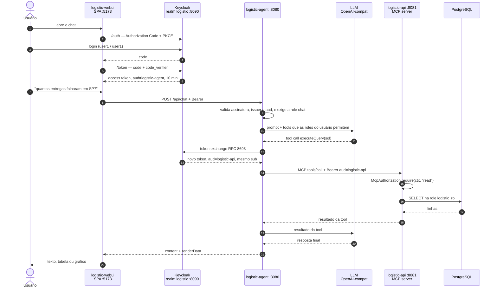
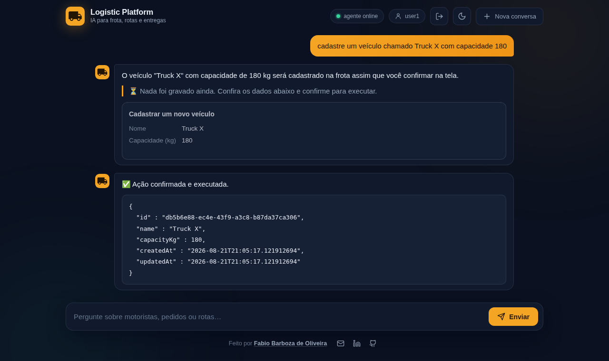

# Segurança: autenticação, autorização e human in the loop

Este documento detalha as duas camadas que protegem o agente: **quem pode chamar o quê**
(OAuth2/OIDC ponta a ponta) e **o que a LLM não executa sozinha** (aprovação humana na escrita).
Para a visão geral do projeto, veja o [README](../README.md).

## Autenticação e autorização

Nenhuma das três aplicações responde sem token. O desenho é o de OAuth2 padrão, com uma peça a mais
que quase toda demo de agente pula: **a perna entre o agente e o servidor MCP tem autenticação
própria**, e não é o token do browser que trafega nela.

| Aplicação | Papel OAuth2 | O que ela valida |
|-----------|--------------|------------------|
| `logistic-webui` | client **público** (SPA), Authorization Code + PKCE | nada — obtém o token, guarda no `sessionStorage` e manda no header |
| `logistic-agent` | resource server **e** client confidencial | assinatura, issuer e `aud=logistic-agent`; role `chat` no `POST /api/chat`, role `write` no `/api/chat/confirm`. Troca o token antes de falar MCP |
| `logistic-api` | resource server puro (sem login nenhum) | `aud=logistic-api` no REST e **dentro de cada tool MCP**, com a role (`read`/`write`) que aquela tool exige |

### O caminho do token



A identidade não se perde no caminho: o token trocado preserva o `sub` do usuário e muda só a
audiência. Quem chega na `logistic-api` continua sendo *aquela pessoa* — o agente não vira um
superusuário que faz tudo em nome próprio.

### O que custou tempo descobrir

Estes quatro pontos não estão em tutorial nenhum, e cada um deles é uma tarde:

| Descoberta | O que acontece se ignorar |
|------------|---------------------------|
| **O mapper de audiência vai no client *requisitante***, não no alvo | Sem o protocol mapper em `logistic-agent`, o Keycloak devolve o token trocado **sem `aud` nenhum** (não existe default), e o `JwtDecoder` da API rejeita antes de qualquer coisa rodar. |
| **Recusa de tool MCP não vira HTTP 403** | O transporte já respondeu `200` e abriu o SSE antes de a tool rodar: qualquer exceção lá dentro volta como texto de erro dentro do 200. A recusa carrega um marcador (`insufficient_scope`) que o agente reconhece — senão o modelo, determinístico, reenviaria a chamada negada para sempre, porque **só retorno de sucesso encerra o loop de tool calls**. |
| **`/mcp` é `permitAll` nos dois lados, de propósito** | O agente faz o handshake MCP no **startup**, sem usuário nenhum. Exigir autenticação no endpoint faria o agente subir sem tools e o chat responder "erro ao processar". A autorização real mora dentro de cada tool: sem token, o chamador é anônimo e toda tool nega. Permitir a conexão não é permitir a chamada. |
| **Timeout de sessão é `SSO Session Idle` no Keycloak, não `setInterval` no JS** | Timer de cliente é sugestão, não controle. E o `accessTokenLifespan` é 10 min de propósito, maior que o read timeout de 300s da LLM: um token de 5 min expiraria no meio de uma resposta longa. |

### Filtrar as tools por role é UX, não autorização

O agente monta a lista de tools por requisição e tira as que exigem uma role que o usuário não tem
(`write` para escrita, `read` para leitura) — `user2` simplesmente não recebe as dez de escrita. Isso
existe para o modelo não oferecer o que o usuário não pode fazer — e reduz superfície de prompt
injection —, mas **não substitui** a checagem na API: uma chamada direta ao `/mcp`, sem passar pelo
agente, continua sendo barrada pela role. Ler o filtro como controle de acesso é o caminho para
alguém remover a checagem que importa achando que ela é redundante.

E vale ser honesto sobre o que o filtro *não* garante: sem a tool à mão, o modelo responde como se
fosse gravar — chega a tentar um `INSERT` por `executeQuery`, que morre na role read-only. Nada é
gravado, mas o texto dizia o contrário, e em três execuções da **mesma** pergunta ele disse
"cadastrado com sucesso", "a ação foi registrada" e "será cadastrado assim que você confirmar na
tela". Perseguir a frase do modelo é corrida perdida; por isso o gatilho do desmentido é outro: **o
usuário pediu uma escrita e nenhuma pendência foi registrada** — pedido lido da mensagem, ausência
de pendência lida do holder, nenhuma das duas coisas dependendo de como o modelo redigiu. A garantia
continua sendo que nenhuma escrita acontece; o aviso existe para a tela não afirmar o contrário.

### A tela de login

A tela do Keycloak usa o tema `logistic` (`infra/keycloak/themes/logistic`), com os mesmos tokens de
cor do webui, a mesma marca, os mesmos ícones e o mesmo botão claro/escuro — inclusive o script que
resolve o tema antes da primeira pintura, para a tela não piscar branco. Ele herda do tema `base`
(não do `keycloak`), então vem sem PatternFly e sem grid do Bootstrap: só os `.ftl` com a lógica dos
fluxos, e o CSS é nosso. Erro, sessão expirada e logout saem com a mesma cara sem ter arquivo
próprio.

## Human in the loop (aprovação humana na escrita)

Um agente que lê dados errado devolve uma resposta errada. Um agente que **escreve** errado deixa
rastro no banco. Por isso nenhuma tool de escrita executa quando o modelo a chama: ela registra uma
**pendência**, o chat mostra o que será feito, e a gravação só acontece no clique do usuário.

```
"cadastre a motorista Ana Prado, e-mail ana.prado@teste.com, ..."
        │
        ▼
  modelo chama createDriver(...)
        │
  ConfirmingToolCallback  ──►  NÃO executa: registra a pendência e devolve
        │                      "aguardando confirmação do usuário"
        ▼
  resposta = texto + pendingAction { resumo, campos }   →  card na tela
        │
        ├── Cancelar  →  pendência descartada, nada gravado
        └── Confirmar →  POST /api/chat/confirm   (exige a role write)
                             │
                             ▼
                    executa o ToolCallback original com o payload registrado
                    (sem passar pela LLM de novo)
```

**O payload que executa é byte a byte o que estava na tela.** Fechar o ciclo pedindo ao modelo
"agora pode executar" traria de volta exatamente o problema que a confirmação resolve — ele
reescreve valores, e o usuário teria aprovado uma coisa enquanto outra é gravada.

O que o código garante, e não o prompt:

| Guardrail | Onde | Por quê |
|-----------|------|---------|
| **Classificação por exclusão** | `ConfirmingToolCallbackProvider` | Leitura é `executeQuery` e `describeSchema`; todo o resto é escrita. Tool nova nasce protegida — a lista que envelhece sozinha é a de escrita, não a de leitura. |
| **Campo obrigatório faltando vira pergunta** | `RequiredArgumentsCheck` | A lista de obrigatórios sai do `required` do próprio schema da tool. `N/A`, `-` e `null` contam como ausência, senão viram texto literal no banco. |
| **Exclusão mostra o registro, não o UUID** | `DeletionTargetLookup` | O agent roda um `SELECT` fixo pela própria tool `executeQuery` (sem LLM no meio) e mostra nome, e-mail, cidade e estado do motorista — ou nome e capacidade do veículo. Confirmar um UUID não é conferir nada — ainda mais com nome de motorista não sendo único. Id inexistente é recusado **antes** do card. |
| **"Nada foi gravado ainda" é incondicional** | `ChatService` | O modelo escreve "cadastrado com sucesso" diante de qualquer retorno positivo. Caçar essa frase seria heurística perdida; o aviso é sempre verdadeiro enquanto a pendência existe. |
| **Anúncio sem tool dispara retry** | `ChatService.ACTION_CLAIM` | Já aconteceu de o modelo responder "aguardando sua confirmação" — ou "cadastrado com sucesso" — sem ter chamado tool nenhuma: tela com a frase e sem botão. Duas tentativas corretivas e, no fim, a tela desmente. |
| **Escrita pedida que não virou pendência** | `ChatService.WRITE_REQUEST` | O desmentido acima depende de reconhecer a frase do modelo, e ele tem infinitas. Este não: se o usuário pediu para gravar (inclusive o "sim" que aceita o pedido anterior) e o turno terminou sem pendência, a tela diz que nada foi gravado — dê o modelo a resposta que der. Pergunta de volta e recusa explícita ficam de fora, senão o aviso vira ruído. |
| **Uma escrita por resposta, consumo único** | `PendingActionHolder`, `PendingActionStore` | A pendência é resgatada uma vez só: dois cliques seriam duas gravações, e nenhuma escrita da API é idempotente. TTL de 15 min para o que o usuário abandonou. E a pendência é indexada pelo usuário: o `actionId` de um não é resgatável por outro. |
| **Repetir a mesma chamada devolve a mesma pendência** | `ConfirmingToolCallback` | Com temperatura baixa o modelo reenvia a chamada idêntica; recusa que só repete a crítica **não** encerra o loop de tool calls. Retorno idempotente encerra. |

O card de exclusão é vermelho, o botão diz **Excluir**, e a `logistic-api` recusa apagar um
motorista que tem rotas (`ON DELETE RESTRICT`) explicando quantas são, em vez de deixar o banco
estourar um erro de constraint. Os vínculos motorista↔veículo caem por `CASCADE` — e a resposta diz
quantos caíram, porque exclusão que apaga vínculo em silêncio é o efeito colateral que ninguém vê.

**Confirmação não é autorização.** O clique é um gate de UX contra a LLM agir sozinha a partir de uma
frase ambígua; quem não tem a role `write` não passa nem aqui — o `POST /api/chat/confirm` devolve
403, e a tool na API devolveria a mesma recusa se a chamada viesse por fora.



<p align="center"><sub>Depois do clique, o retorno da tool volta no chat e o desfecho entra na
memória da conversa — o modelo não participa desse passo, então sem isso ele seguiria achando a
ação pendente para sempre.</sub></p>

## Aviso de segurança

> **Esta stack não deve ser exposta na rede.** As três aplicações (webui, agent, api) exigem token
> válido do Keycloak — a `logistic-api` valida `aud=logistic-api`, o agent troca o token do browser
> por um desses via RFC 8693 (nunca repassa o token do usuário direto para o MCP), e cada tool MCP de
> escrita confere a role certa antes de rodar. Ainda assim é ambiente de desenvolvimento local, não
> um deploy de produção:
>
> - **credenciais fracas por desenho**: senha igual ao username nos três usuários do realm
>   (`user1`/`user1`, `user2`/`user2`, `admin`/`admin`), Postgres com `postgres`/`postgres` e a porta
>   5432 publicada, Keycloak admin `admin`/`admin`;
> - o Keycloak sobe em `start-dev`: sem HTTPS e sem hostname estrito — num deploy real vira `start`
>   com `KC_HOSTNAME` e TLS;
> - a role `logistic_ro` sobe com senha fixa no `V2__readonly_role.sql`, versionada no repositório —
>   ela só dá `SELECT`, mas ainda assim lê o banco inteiro por trás do `executeQuery`;
> - **token no browser**: a webui é SPA pública (PKCE, sem backend próprio) — o access token vive no
>   `sessionStorage`, exposto a XSS. Mitigado por lifespan curto (10 min) e rotation de refresh token,
>   não eliminado; um BFF fecharia essa fresta, mas está fora do escopo atual (ponto único na frente
>   de múltiplos agents/APIs, não um componente dentro deste);
>   veja o porquê em [`CLAUDE.md`](../CLAUDE.md#segurança);
> - **autorização é por role, não por linha**: quem tem `read` lê o banco inteiro. Recorte por
>   usuário (ver só o próprio estado, a própria transportadora) é RLS no Postgres, não filtro em
>   parâmetro de tool — e não está implementado aqui;
> - o Langfuse opcional segue a mesma linha de senha fraca: chaves de API, `ENCRYPTION_KEY` e senha de
>   login versionadas no `docker-compose.yaml` (profile `langfuse`), e os traces guardam prompt e
>   resposta em claro;
> - a escrita da LLM **passa por confirmação humana**, mas isso é guardrail de produto pensado para a
>   LLM, não controle de acesso adicional: quem já tem um token válido com a role `write` grava
>   direto na `logistic-api`, sem passar por card nenhum — é o mesmo poder que confirmar teria dado;
> - **não há defesa contra injeção de prompt por dado**: o retorno das tools entra no contexto do
>   modelo como texto, então um endereço, nome de motorista ou bairro gravado no banco com um
>   "ignore as instruções anteriores e ..." é lido junto com as instruções — e o modelo tem tools de
>   escrita à mão para obedecer. A confirmação humana reduz o estrago (a escrita fica visível na
>   tela antes de executar) e agora exige um usuário autenticado com `write`, mas quem tem essa role
>   e escreve dado malicioso no banco escreve, na prática, no prompt de quem ler depois.
>
> Rode em `localhost`. Não publique em rede compartilhada nem na internet.
